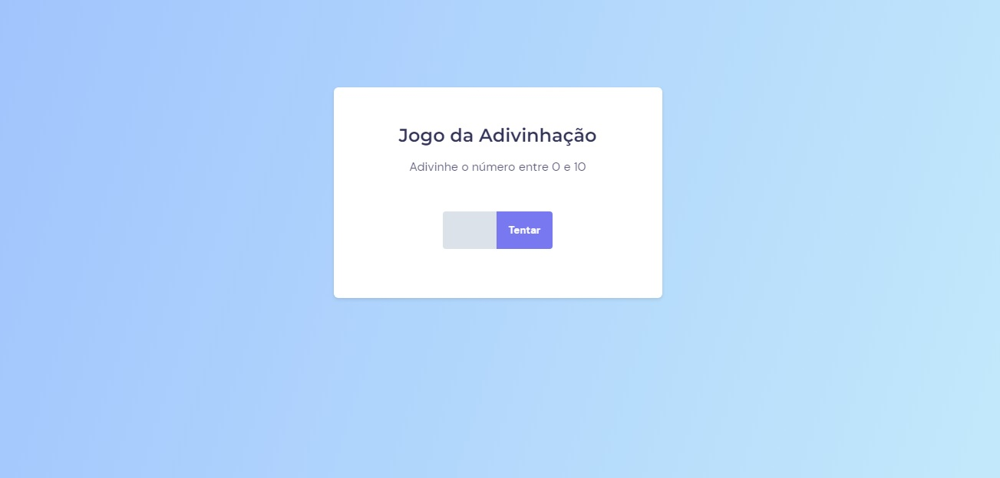

<h1 align="center"> Componente Trabalho </h1>

Projeto avançado do explorer 10, um Jogo de Advinhar  
<a href="https://www.rocketseat.com.br/explorer">Connheça o Explorer.</a>

  <a href="#-tecnologias">Tecnologias</a>&nbsp;&nbsp;&nbsp;|&nbsp;&nbsp;&nbsp;
  <a href="#-projeto">Projeto</a>&nbsp;&nbsp;&nbsp;|&nbsp;&nbsp;&nbsp;
  <a href="#-layout">Layout</a>&nbsp;&nbsp;&nbsp;|&nbsp;&nbsp;&nbsp;
  <a href="#memo-licença">Licença</a>

  

 

  

## 🚀 Tecnologias

Esse projeto foi desenvolvido com as seguintes tecnologias:

- HTML
- CSS
- JavaScript
- Git e Github

## 💻 Projeto
Criamos um **Jogo de Adivinha**. Colocamos um numero no input e clicamos no botão para o sistema verificar se o número digitado é igual ao número escolhido pelo sistema, quando acertamos mostra uma mensagem falando em quantas vezes acertamos o número.   
 se colocamos quanquer número diferente de 0 a 10, é apresentado uma messagem de erro **( Erro: o número deve ser entre 0 e 10!  
        Por favor, tente novamente! )**.   
 se apertamos o botão com input vazio é apresentado uma mensagem de erro **( Erro: o campo nao pode ser vazio!
        Digite um número entre 0 e 10! )**.

- [Acesse o projeto finalizado, online](https://erlanmarinho.github.io/explorerJogoDaAdvinhacao/)

## :memo: Licença

Esse projeto está sob a licença MIT.

---

Feito com ♥ by Rocketseat :wave: [Participe da nossa comunidade!](https://discord.gg/rocketseat)
